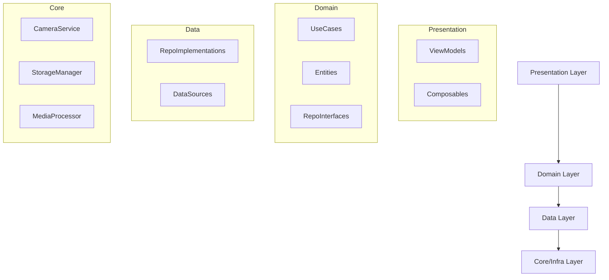

# System Architecture Topology

## 1. High-Level Layers (Clean Architecture)

## 2. Module Boundaries
*   **App Module (`:app`)**: Contains Logic (Monolith structure for simplicity).
*   **Core Logic**: `com.dailyflash.core.*`
    *   `camera`: CameraX wrapper
    *   `storage`: FileSystem wrapper
    *   `media`: Transformer wrapper
    *   `notification`: AlarmManager/NotificationManager wrapper
    *   `settings`: DataStore wrapper
*   **Domain Logic**: `com.dailyflash.domain.*`
    *   `GetMonthVideosUseCase`
    *   `SaveVideoUseCase`
    *   `DeleteClipUseCase`
    *   `ExportJournalUseCase`
    *   `settings`: `GetSettingsUseCase`, `UpdateReminderUseCase` (Grouped)
*   **UI Logic**: `com.dailyflash.presentation.*`
    *   `camera`: CameraScreen + ViewModel
    *   `calendar`: CalendarScreen + ViewModel
    *   `export`: ExportScreen + ViewModel
    *   `gallery`: GalleryScreen + ViewModel
    *   `settings`: SettingsDialog/Screen

## 3. Dependency Rules
1.  **Strict Unidirectional**: Presentation depends on Domain. Domain depends on *nothing*. Data depends on Domain (Impl) and Core.
2.  **Abstractions**: UseCases talk to Repository Interfaces (in Domain). Repositories talk to Core Interfaces.
3.  **No Leaks**: Android Framework classes (Context, Bundle) should strictly stop at the Presentation/Data boundary and NOT leak into Domain.
